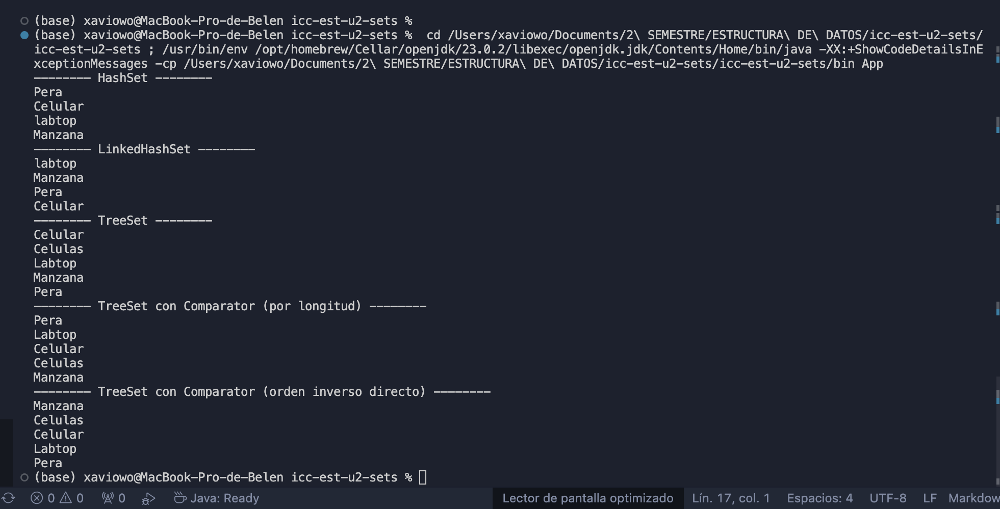

# 🧠 Práctica sobre Sets en Java

**Carrera:** Computación  
**Asignatura:** Estructura de Datos  
**Práctica:** Conjuntos (`Set`)  
**Estudiante:** *Erika Collaguazo*  
**Docente:** Ing. Pablo Torres  

---

## 🎯 Objetivos

- Comprender el funcionamiento de las implementaciones de `Set` en Java.
- Comparar el comportamiento y el ordenamiento de `HashSet`, `LinkedHashSet`, `TreeSet` y `TreeSet` con `Comparator`.
- Identificar cómo se eliminan duplicados y cómo se conserva el orden (o no) en cada tipo de conjunto.
- Aplicar comparadores personalizados para ordenar elementos con criterios específicos.

---

## 🧪 Descripción de la práctica

La práctica consiste en implementar diferentes tipos de conjuntos en Java (`Set`) para observar sus características:

### Tipos de conjuntos utilizados:

1. **HashSet:**  
   No garantiza orden. No permite duplicados.

2. **LinkedHashSet:**  
   Mantiene el orden de inserción. No permite duplicados.

3. **TreeSet:**  
   Ordena los elementos de forma natural (alfabética). No permite duplicados.

4. **TreeSet con Comparator:**  
   Ordena según un criterio personalizado, en este caso, **por longitud de la cadena**.

5. **TreeSet con Comparator Reverso:**  
   Similar al anterior, pero ordena de **mayor a menor longitud** (orden inverso).

---

## 🧩 Implementación

Se definió una clase `Sets` que contiene los métodos:

- `construirHashSet()`
- `construirLinkedHashSet()`
- `construirTreeSet()`
- `construirTreeSetConComparador()`
- `construirTreeSetConComparadorReverso()`

Y una clase `App` con métodos para imprimir los conjuntos y observar diferencias en la salida.

---

## 💻 Grafica de salida esperada

